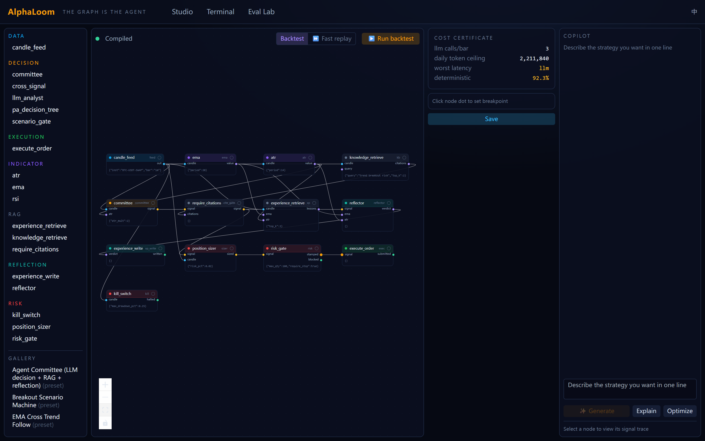
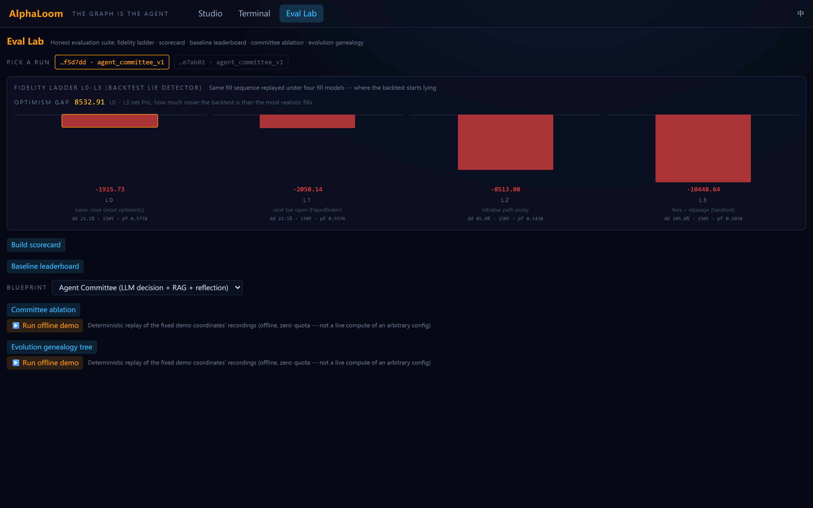
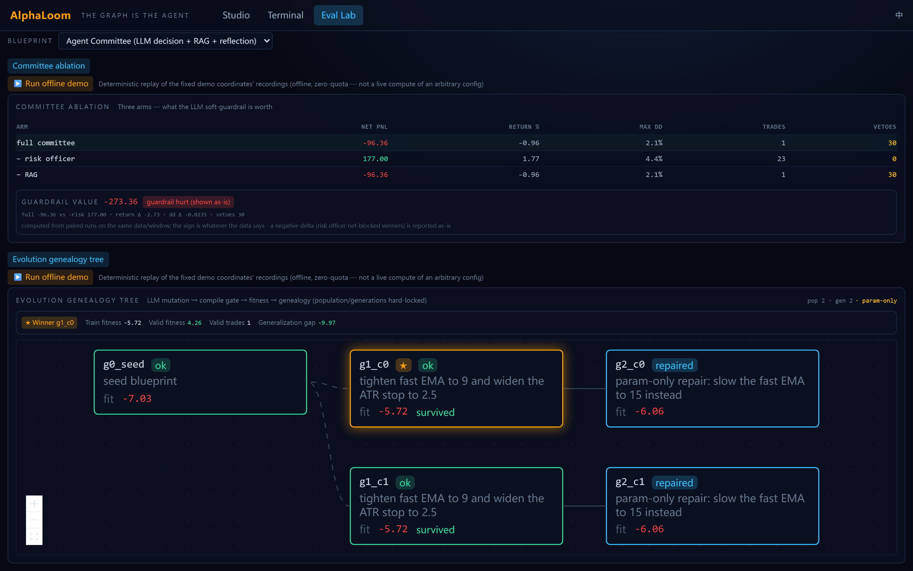
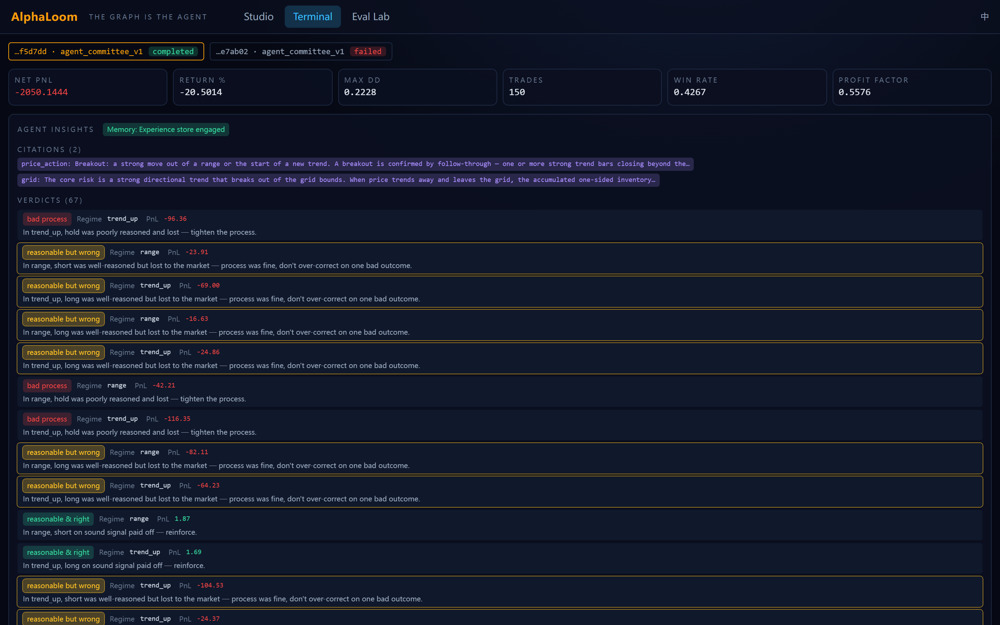

<div align="center">

# 🧬 AlphaLoom

### The graph **IS** the agent.

An agent-native quant trading platform where a strategy is not a code file — it's a visual **blueprint** (an Unreal-Engine-style node graph) that *compiles* into an executable, falsifiable trading agent.

[](https://github.com/ZhaoSH980/alphaloom/actions/workflows/ci.yml)


</div>

---

## Why it's different

General agent frameworks (LangChain, LangGraph, Langflow) orchestrate **conversation**, which has no ground truth. AlphaLoom compiles **falsifiable trading organisms**, where every decision is judged by realized market data. That difference lets the compiler *prove* things a conversation framework structurally cannot:

- **🔒 The type system is the compliance officer.** `ExecuteOrder` only accepts a `risk_stamped_signal` — a type that *only* a `RiskGate` node can produce. A graph that routes a raw signal to an order (or a Copilot/LLM that tries to synthesize one) **fails to compile**. Bypassing risk control isn't a policy you enforce; it's a sentence the language cannot express.
- **📜 Static cost certificate.** The compiler walks the graph and tells you — *before you run it* — the worst-case LLM calls per bar, the daily token ceiling, the worst-case latency class, and what fraction of the graph is deterministic (offline-replayable).
- **⏳ Causal typing.** Market-data pins carry an *as-of* timestamp; the runtime rejects any read of data later than the current bar. Look-ahead bias becomes a compiler-assisted, runtime-enforced error — not a bug you find after the fact.
- **📊 Honest evaluation, by design.** The Eval Lab ships five *falsifiable* evaluation tools (below). AlphaLoom is a **methodology demonstration** — the honesty is the deliverable, not a directly-deployable alpha. See [`docs/evaluation-methodology.md`](docs/evaluation-methodology.md).

> Built as an interview showcase for an AI Agent Engineer role; sibling project to [Hindsight](https://github.com/ZhaoSH980/hindsight).

---

## See it

**① Blueprint Studio — the graph *is* the agent.** Drag-and-connect canvas with typed pins; the **cost certificate** is computed before you run (3 LLM calls/bar, 92.3% deterministic); the red **`risk_gate`** node is the only path into `execute_order`.



**② Fidelity ladder — the backtest lie detector.** The *same* fill sequence replayed under four fill models. Net PnL degrades monotonically L0→L3; the **optimism gap** is exactly how much rosier the naive backtest was than the most realistic fills. (Zero LLM calls — it re-matches existing fills, it doesn't re-run the agent.)



**③ Committee ablation + evolution genealogy — honest, even when it's unflattering.** The ablation reports guardrail value *with its sign either way* — in this window the risk officer **hurt** performance (net-blocked winners), shown as-is, not spun. The evolution lab lets the LLM mutate the graph (compile-gated), and the winner is scored on a **held-out** window.



**④ Terminal — every decision is traceable.** RAG citations, and the reflection **four-quadrant** taxonomy that separates *reasonable-but-wrong* from *bad-process* (don't punish a sound decision for one bad outcome).



---

## What's inside

| Layer | What it does |
|---|---|
| **Blueprint compiler** | `.loom` JSON → typed node graph → topological plan + cost certificate. Type-checks pins, expands subgraphs, rejects illegal cycles, enforces the risk-stamp rule. |
| **Event-driven engine** | Wave-based execution, deterministic replay, breakpoints + full I/O recording (the substrate for time-travel debugging). |
| **Backtest + brokers** | Next-bar-open fill semantics (no look-ahead), attached stops, EOD settlement; paper broker (OKX-demo broker sketched). |
| **Agent nodes** | `LLMAnalyst`, `Committee` (strategist → risk-officer → chair with **code-enforced veto**), `PADecisionTree` (deterministic numeric gate — "don't trust the LLM's mouth"), `KnowledgeRetrieve` (BM25 RAG, EN + 中文), `RequireCitations` (forced-citation gate), `Reflector` (process/outcome scoring), experience store by market-regime bucket. |
| **Copilot** | Text-to-Blueprint: describe a strategy in natural language → a compilable graph. **Compile-error self-repair**: when the LLM emits a graph that fails to compile, the `CompileError`'s fix-hint is fed back and it repairs itself (≤3 tries). Explain / Optimize. |
| **Text-to-Node sandbox** | AST-whitelist compiler that hot-registers custom nodes; red-teamed against 40+ classic Python escapes; sandboxed nodes are stripped of the LLM handle and cannot forge the risk stamp. |
| **Eval Lab** | Five offline-replayable evaluation tools: fidelity ladder · blueprint scorecard · baseline leaderboard · committee ablation · evolution genealogy. |
| **Studio + Terminal (React)** | Drag-and-connect canvas with typed pins, live compile feedback, cost-certificate panel, run-time glow, breakpoint inspector; Terminal shows candles + fills, equity, committee traces, RAG citation badges, and the reflection four-quadrant verdicts. |

---

## Quick start (zero API key, zero quota)

```bash
# backend
cd backend && python -m venv .venv && .venv/Scripts/python -m pip install -e .[dev]
# frontend
cd ../frontend && npm install && npm run build
# one-process offline demo  (Windows: demo.bat does all of this)
cd .. && ALPHALOOM_OFFLINE=1 backend/.venv/Scripts/python -m uvicorn alphaloom.serve:app --port 8000 --app-dir backend
# open http://localhost:8000  → Studio · Terminal · Eval Lab
```

Run the `agent_committee` blueprint in the Studio: it replays **committed LLM recordings** with **zero network calls** — 301 bars, 150 trades, committee decisions, and reflection verdicts across all four quadrants, instantly. In the **Eval Lab**, click each panel's **"▶ Run offline demo"** to replay the ablation and evolution recordings offline.

---

## On the LLM recordings (honest framing)

AlphaLoom's LLM calls go through a **record/replay layer** (ported from Hindsight): every request is canonicalized and hashed; a cache hit means no network. `ALPHALOOM_OFFLINE=1` replays committed recordings so the demo runs anywhere, offline, at zero quota. The committed `data/llm_calls.sqlite` contains **two clearly-distinguished sources**:

1. **835 deterministic seed responses** (`model: spark-x1`) — hand-authored, valid-shaped canned responses that drive a *rich, reproducible* demo: varied committee decisions, risk-officer vetoes, trades, all four reflection quadrants, a Copilot compile-error self-repair, plus the three-arm **committee ablation** and the small-scale **evolution lab** so every Eval Lab visualization renders offline. **These are synthetic, not real LLM output** — their purpose is a deterministic zero-quota showcase that anyone can regenerate with `scripts/seed_recordings.py`. The official demo coordinates live in `backend/alphaloom/eval/demo_coords.py`, which **both** the seed script and the API import, so they can never drift.
2. **123 real 讯飞 (iFlytek Spark) `astron-code-latest` calls** — genuine recorded responses from a 40-bar `agent_committee` run against the real endpoint, offline-verified to replay at **123 hits / 0 miss**. In that window the real committee traded conservatively (all flat/hold) — authentic LLM behavior, not curated. This proves the pipeline works against a real LLM.

To run live or record your own (longer, real) window: put `LLM_BASE_URL` / `LLM_API_KEY` / `LLM_MODEL` in a repo-root `.env` (never committed) and run without `ALPHALOOM_OFFLINE`. Rate-limit backoff (429) is built in.

---

## Testing & safety

- **404 backend tests** (pytest), frontend tsc-strict + vitest. CI runs both offline/deterministically ([`.github/workflows/ci.yml`](.github/workflows/ci.yml)) — no real LLM, zero quota.
- Reviewed task-by-task with an independent adversarial reviewer; a red-team pass on the Text-to-Node sandbox tried 40+ classic escapes (dunder chains, format-string dunder, metaclass hooks, import bypass, private-slot reach-back) — all blocked. Sandboxed nodes are stripped of the LLM handle (a `WeakKeyDictionary`-backed restricted context), so a custom node **cannot** quietly burn your API quota — the same "compliance officer" principle as the risk stamp.
- No secrets in the repo or its history; `.env` is git-ignored and was never committed.

---

## Documentation

- [`docs/evaluation-methodology.md`](docs/evaluation-methodology.md) — what the evaluation tools measure, what they do **not**, and exactly where each stops being trustworthy (single synthetic instrument, small windows, N=1 causal claims, synthetic-seed vs. real-LLM recordings). The capstone of the honest-evaluation brand.
- [`docs/demo-script.md`](docs/demo-script.md) — a 10-minute offline talk track (start → Studio `TYPE_MISMATCH` → cost cert → `agent_committee` replay → Eval Lab "▶ Run offline demo" → Copilot self-repair), each step mapped to a JD capability.
- [`docs/future-work.md`](docs/future-work.md) — known boundaries and roadmap (multi-market data, evolution scale, cgroup sandbox limits, registry namespacing, counterfactual-fork UI).
- `docs/superpowers/` — the design spec, per-day plans, and per-task adversarial review trail.

---

## Status

**Complete** — D1 (graph core / compiler / engine / backtest) · D2 (API/WS + Studio + Terminal) · D3 (LLM nodes / Copilot / reflection / recordings) · D4 (evaluation suite: fidelity ladder, blueprint scorecard, baseline leaderboard, committee ablation, evolution lab + genealogy, five offline-replayable Eval Lab visualizations). Tagged `d1-complete` → `d4-complete`, every task passed a two-stage adversarial review plus a live browser walkthrough.

<div align="center">

**MIT © 2026 Zhao Chenghao**

</div>
