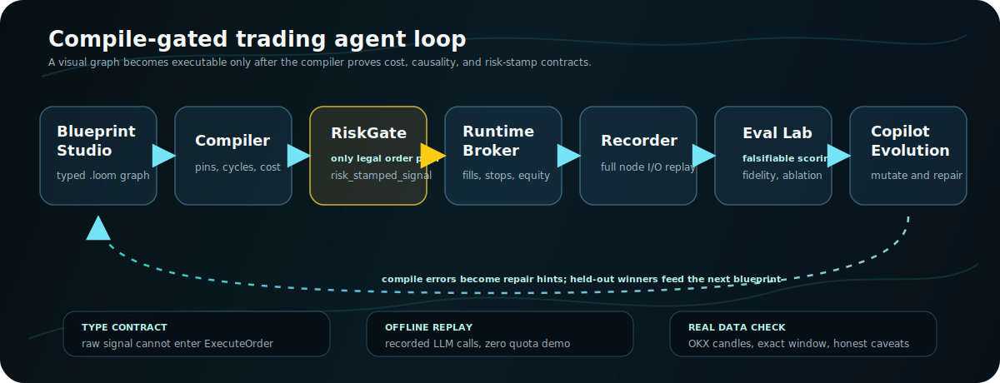

<div align="center">


# AlphaLoom

**The graph IS the agent.**

An agent-native quant trading platform where `.loom` visual blueprints compile into typed, auditable, falsifiable trading agents.

[](https://github.com/ZhaoSH980/alphaloom/actions/workflows/ci.yml)
&nbsp;
&nbsp;
&nbsp;
&nbsp;

<br>



**Draw a trading graph. Compile the guardrails. Replay every decision. Score it against real market data.**

</div>

## Why This Exists

Most agent frameworks orchestrate conversation. Conversation is flexible, but it rarely has ground truth.

AlphaLoom uses trading as a harder laboratory for agent engineering: every action has a timestamp, a fill model, a PnL, a drawdown, and an audit trail. The goal is not to ship a magic alpha. The goal is to show a complete agent system where the compiler, runtime, recorder, and evaluator make claims that can be checked.

<table>
<tr>
<td width="33%">
<strong>Risk cannot be bypassed</strong><br>
<code>ExecuteOrder</code> only accepts a <code>risk_stamped_signal</code>. Only <code>RiskGate</code> can produce that type. A graph that routes raw LLM output into an order fails before it can run.
</td>
<td width="33%">
<strong>Cost is known before runtime</strong><br>
The compiler emits a static certificate: worst-case LLM calls per bar, token ceiling, latency class, deterministic ratio, and risk-gate coverage.
</td>
<td width="33%">
<strong>Evaluation is falsifiable</strong><br>
Backtests, fidelity ladders, scorecards, ablations, baselines, and evolution runs all replay from recorded inputs instead of asking you to trust a screenshot.
</td>
</tr>
</table>

## Start In One Click

Windows demo:

```bat
START_ALPHALOOM.cmd
```

That command bootstraps the backend if needed, ensures the demo database exists, builds the frontend, starts the offline replay server, and opens:

```text
http://127.0.0.1:8000/#/studio
```

Manual Windows path:

```powershell
# backend
cd backend
py -3.12 -m venv .venv
.\.venv\Scripts\python.exe -m pip install -e .[dev]

# frontend
cd ..\frontend
npm install
npm run build

# one-process offline demo
cd ..
$env:ALPHALOOM_OFFLINE = "1"
backend\.venv\Scripts\python.exe -m uvicorn alphaloom.serve:app --port 8000 --app-dir backend
```

No API key is required for the showcase. The committed replay database lets the Studio, Terminal, and Eval Lab run offline with zero quota.

## 30-Second Demo Path

| Step | What to show | Why it matters |
|---|---|---|
| 1 | Open **Studio** and load `agent_committee` | The agent is a typed graph, not hidden prompt glue. |
| 2 | Point at `risk_gate -> execute_order` | Risk control is a compile-time language rule. |
| 3 | Show the cost certificate | LLM cost and determinism are visible before a run starts. |
| 4 | Run the offline replay | Committee decisions, fills, equity, citations, and reflection verdicts appear without network calls. |
| 5 | Open **Eval Lab** | The same run is judged by fidelity, scorecard, baselines, ablation, and evolution genealogy. |
| 6 | Show the real OKX smoke test | The graph can run on real historical candles, with caveats stated up front. |

## Visual Tour

**Blueprint Studio.** Typed pins, live compile feedback, cost certificate, and a graph where the red risk gate is the only legal path into execution.


**Fidelity ladder.** The same fills are replayed under stricter fill models. The optimism gap makes naive backtest assumptions visible.


**Scorecard and baseline leaderboard.** AlphaLoom does not trust in-sample PnL by itself. Held-out performance, evidence coverage, and baseline ranking drive the score.

<table>
<tr>
<td width="50%"></td>
<td width="50%"></td>
</tr>
</table>

**Committee ablation.** The risk officer is measured honestly. If the guardrail hurts the window, the UI says so.


**Evolution genealogy.** The LLM mutates blueprints, compile errors produce repair hints, survivors breed, and winners are judged on held-out data.


**Terminal trace.** Every decision is inspectable: committee rationale, RAG citations, fills, reflection labels, and process/outcome separation.


## Real Market Smoke Test

The polished offline demo is deterministic, but AlphaLoom can also run the same compile-gated graph on public market data. A small OKX scan produced a cleaner README example than the original demo numbers:

| Item | Value |
|---|---|
| Blueprint | [`blueprints/real_sol_breakout_demo.loom`](blueprints/real_sol_breakout_demo.loom) |
| Market data | OKX public `SOL-USDT-SWAP` 1m candles |
| Window | 2026-06-24 04:12Z to 2026-06-27 04:12Z |
| Result | **+9.0439% return**, **8.2020% max drawdown** |
| Trades | 93 trades, 50.54% win rate, profit factor 1.3774 |
| Buy and hold | +4.0152% return, 8.5091% max drawdown |

This is a smoke test, not an alpha claim. It is included because a showcase trading system should be able to demonstrate a real-data run, exact parameters, and honest caveats. See [`docs/real-data-smoke-test.md`](docs/real-data-smoke-test.md) for the download command, data range, blueprint parameters, and reproduction notes.

## What Is Inside

| Layer | What it does |
|---|---|
| Blueprint compiler | `.loom` JSON to typed node graph to topological plan plus cost certificate. It type-checks pins, expands subgraphs, rejects illegal cycles, and enforces the risk-stamp rule. |
| Event runtime | Wave-based execution, deterministic replay, breakpoints, full node I/O recording, and time-travel-style inspection. |
| Backtest engine | Next-bar-open fills, attached stops, end-of-day settlement, no look-ahead reads, and broker abstraction. |
| Agent nodes | `LLMAnalyst`, `Committee`, deterministic gates, BM25 RAG, citation requirements, reflection scoring, and regime-bucketed experience memory. |
| Copilot | Natural language to blueprint, compile-error self-repair, explanation, and optimization. |
| Text-to-node sandbox | AST-whitelisted custom node compiler, red-teamed against Python escape patterns, with no access to the LLM handle and no ability to forge the risk stamp. |
| Eval Lab | Fidelity ladder, scorecard, baseline leaderboard, committee ablation, and evolution genealogy. |
| React Studio + Terminal | Drag-and-connect canvas, compile feedback, cost panel, runtime glow, breakpoint inspector, candles, fills, equity, citations, and reflection verdicts. |

## Offline LLM Recordings

Every LLM call goes through a record/replay layer. Requests are canonicalized and hashed; cache hits make the showcase deterministic and network-free.

`ALPHALOOM_OFFLINE=1` replays the committed `data/llm_calls.sqlite` database:

1. **835 deterministic seed responses** using `model: spark-x1`. These are valid-shaped synthetic responses for a rich reproducible demo: varied committee decisions, risk-officer vetoes, all four reflection quadrants, Copilot compile-error repair, ablation, and evolution.
2. **123 real iFlytek Spark `astron-code-latest` calls** from a recorded 40-bar `agent_committee` run. That real window traded conservatively, which is preserved as-is rather than curated into a prettier story.

To run live, place `LLM_BASE_URL`, `LLM_API_KEY`, and `LLM_MODEL` in a repo-root `.env` file and run without `ALPHALOOM_OFFLINE`.

## Safety And Tests

- Backend pytest suite and frontend `tsc --strict` plus vitest are covered by CI.
- Offline tests do not call real LLM endpoints or spend quota.
- The text-to-node sandbox was red-teamed against common Python escape patterns.
- Sandboxed nodes are stripped of the LLM handle and cannot forge the risk stamp.
- Secrets are kept out of the repo; `.env` is ignored.

## Documentation

- [`docs/demo-script.md`](docs/demo-script.md) - a 10-minute offline talk track for presenting AlphaLoom.
- [`docs/evaluation-methodology.md`](docs/evaluation-methodology.md) - what each evaluation tool measures, where it stops being trustworthy, and how to read the caveats.
- [`docs/real-data-smoke-test.md`](docs/real-data-smoke-test.md) - the real OKX data run, exact window, parameters, and reproduction notes.
- [`docs/future-work.md`](docs/future-work.md) - known boundaries and roadmap.
- [`docs/superpowers/`](docs/superpowers/) - design spec, per-day plans, and adversarial review trail.

## Status

Complete showcase build:

- D1: graph core, compiler, engine, backtest
- D2: API, WebSocket events, Studio, Terminal
- D3: LLM nodes, Copilot, reflection, recordings
- D4: fidelity ladder, scorecard, baseline leaderboard, committee ablation, evolution lab, genealogy

AlphaLoom is best read as an engineering demo for agent safety, observability, and evaluation. The trading environment gives the agent something unusually useful for a demo: consequences.

<div align="center">

**MIT (c) 2026 Zhao Chenghao**

</div>
