<div align="center">


<p>
  Language:
  <strong>English</strong>
  ·
  <a href="README.zh-CN.md">中文</a>
</p>

# AlphaLoom

**Draw a trading agent. Compile its risk contract. Replay every decision.**

AlphaLoom is an agent-native trading workbench where a `.loom` visual blueprint becomes a typed, costed, live-incremental, replayable, and falsifiable trading agent.

[](https://github.com/ZhaoSH980/alphaloom/actions/workflows/ci.yml)
&nbsp;
&nbsp;
&nbsp;
&nbsp;

<br>

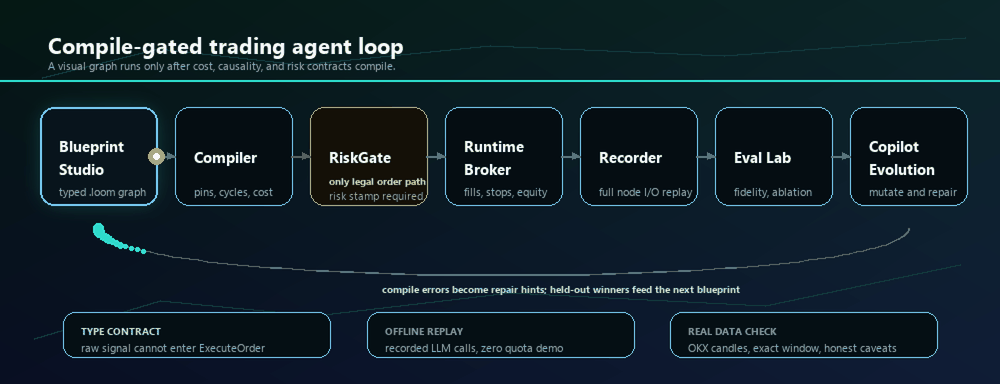

<table>
<tr>
<td align="center"><strong>Blueprint-native</strong><br><sub>Strategy topology is an editable graph, not prompt glue.</sub></td>
<td align="center"><strong>Compile-gated</strong><br><sub>Orders need a typed RiskGate stamp before execution.</sub></td>
<td align="center"><strong>Live incremental</strong><br><sub>Each new candle advances the same run context.</sub></td>
<td align="center"><strong>Falsifiable eval</strong><br><sub>Runs face replay, baselines, ablations, and harsher fills.</sub></td>
</tr>
</table>

**The graph is not a diagram of the agent. The graph is the agent.**

</div>

## What It Is

AlphaLoom is built for an AI Agent Engineer demo: it turns an LLM trading idea into an inspectable runtime protocol. The first layer is an editable blueprint where you can add, remove, or rewire deterministic gates, LLM committee nodes, RAG/citation checks, reflection memory, position sizing, and execution guards. The compiler then proves the legal order path before runtime, so the system can show exactly why an order was allowed, rejected, replayed, or repaired.

It is a research/demo system, not financial advice and not an alpha claim.

## Why AlphaLoom Is Different

Most LLM trading demos hide the important parts in a prompt transcript: the model reads candles, emits a signal, and the audience has to trust the story. AlphaLoom makes those parts first-class artifacts.

| Typical LLM trading bot | AlphaLoom |
|---|---|
| Prompt text is the strategy | `.loom` graph is the strategy protocol |
| LLM can jump from opinion to trade | Raw LLM output cannot enter `ExecuteOrder` |
| Demo success is a screenshot | Runs are replayable from recorded candles and LLM calls |
| Risk control is a paragraph | Risk is a typed gate with compiler-visible contracts |
| Evaluation is a persuasive explanation | Eval Lab runs baselines, fidelity ladders, ablations, and genealogy |

The result is closer to a trading-agent operating system than a chatbot wrapper: Copilot may propose a blueprint, Live Desk may stream bars through it, and Eval Lab may disprove it.

## One Click Demo

Double-click:

```bat
START_ALPHALOOM.cmd
```

The launcher creates missing dependencies, builds the frontend, prepares the deterministic demo database, starts the backend, and opens:

```text
http://127.0.0.1:8000/?alphaloom=...#/studio
```

Default mode is **Offline**: recorded LLM calls, recorded market data, zero network calls, zero LLM quota.

## Runtime Modes

The header can switch modes at any time:

| Mode | Use it for | Requires |
|---|---|---|
| Offline | Safe demos, deterministic replay, committed iFlytek/seed recordings | Nothing |
| Live | Real OpenAI-compatible LLM calls from the UI | `.env` with `LLM_BASE_URL`, `LLM_API_KEY`, `LLM_MODEL` |
| No LLM | Deterministic blueprints, compiler checks, market-only backtests | Nothing |

For Live mode:

```env
LLM_BASE_URL=https://your-openai-compatible-endpoint/v1
LLM_API_KEY=...
LLM_MODEL=astron-code-latest
```

Restart `START_ALPHALOOM.cmd`, then switch `Offline -> Live` in the top-right mode control. Live calls spend real quota.

## Product Surface

| Surface | What to show | Why it matters |
|---|---|---|
| Studio | Editable `.loom` blueprint, type edges, cost certificate, Copilot diff | The agent is the graph. You can swap gates or add LLM components. |
| Live Desk | PA_Agent-style live desk: blueprint left, candles center, gates/reflection/LLM analysis right | A `LiveSession` streams candles into the same run context, so the graph moves bar by bar. |
| Terminal | Run picker, trace explorer, node I/O, committee/reflection evidence | Every decision is replayable and auditable after the run. |
| Eval Lab | Fidelity ladder, scorecard, leaderboard, ablations, evolution genealogy | Results face harsher fills and baselines instead of a persuasive transcript. |

## Blueprint Features

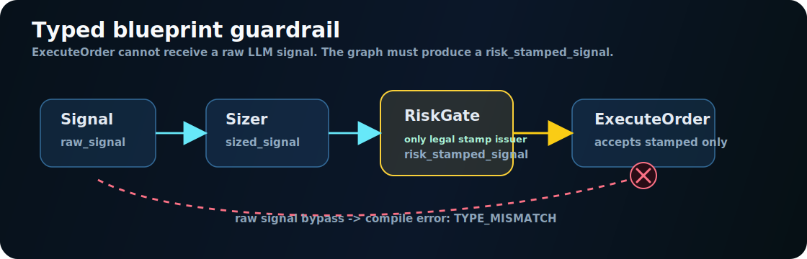<br>
<strong>Risk is a type contract.</strong><br>
<code>ExecuteOrder</code> only accepts a <code>risk_stamped_signal</code>. Raw LLM output cannot trade.

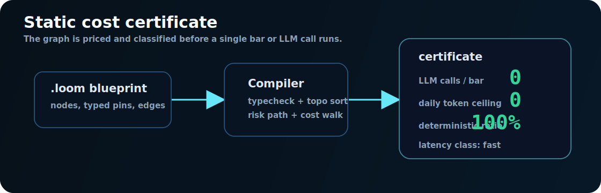<br>
<strong>Cost is known before runtime.</strong><br>
The compiler emits LLM calls per bar, token ceiling, latency class, deterministic ratio, and legal execution path.

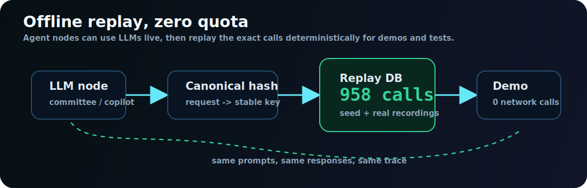<br>
<strong>Demos are deterministic.</strong><br>
Recorded LLM calls replay from hashed requests: same prompts, same responses, zero network calls.

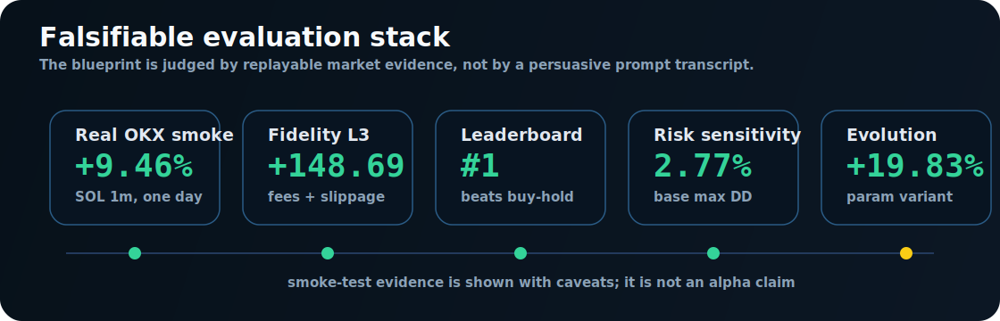<br>
<strong>Evaluation is falsifiable.</strong><br>
Real candles, fill-model ladder, baselines, risk sensitivity, ablation, and genealogy judge the graph.

## Backtest And Replay

Backtests are launched from Studio or Live Desk by choosing:

| Control | Meaning |
|---|---|
| Blueprint | The compiled `.loom` graph to run |
| Market / bar | Instrument and candle interval from the local market catalog |
| Start / end | Exact replay window; charts only display this selected range |
| Cash / fee | Initial capital and transaction-cost assumption |
| Speed | `1x`, `4x`, or instant replay |

During a run, the chart cursor reveals candles, fills, equity, and active graph nodes in replay order. The backtest engine uses next-bar-open fills, attached stops, EOD settlement, and no look-ahead reads; Eval Lab can then replay the same fills under harsher fidelity assumptions.

## Live Incremental Loop

Live Desk is designed to feel like the PA_Agent-style trading console that inspired the project, but with AlphaLoom's compile gate in the middle:

1. A backend `LiveSession` pulls or replays candles by `instrument + bar + timestamp`.
2. Each new bar is fed into the same `Engine` / `RunContext`; node state, positions, reflection memory, and risk state continue forward.
3. The sidecar LLM reads recent candles, current node outputs, risk status, fills, drawdown, and memory, then writes an auditable analysis card.
4. Every sidecar output is recorded with prompt hash, bar timestamp, input summary, output JSON, and model name so Eval Lab can replay it later.

This keeps real-time analysis useful without letting the LLM bypass the blueprint.

**Execution boundary:** Live Desk is paper-live, not exchange-account execution. It can poll OKX public candles and run the graph at live cadence, but all fills go through the local `PaperBroker`; AlphaLoom currently does not submit OKX demo-account or real-money orders.

## Copilot Role

Copilot is the strategy authoring layer. It can create a new `.loom` blueprint from natural language, explain an existing graph, adjust gate parameters, add LLM/RAG/reflection nodes, optimize a variant, or repair compiler errors.

It is deliberately not an execution shortcut. Proposed changes appear as a diff, then must compile through the typed graph before any backtest or execution path is legal. This keeps the LLM useful as a strategy builder while the runtime remains gate-driven and auditable.

## Real Market Smoke Test

Same blueprint, same type gate, public OKX candles:

| Item | Value |
|---|---|
| Blueprint | [`blueprints/real_sol_breakout_demo.loom`](blueprints/real_sol_breakout_demo.loom) |
| Market data | OKX public `SOL-USDT-SWAP` 1m candles |
| Window | 2026-06-25 04:12Z to 2026-06-26 04:12Z |
| Result | **+9.4646% return**, **2.7693% max drawdown** |
| Trades | 29 trades, 68.97% win rate, profit factor 3.0025 |
| Buy and hold | +0.4761% return, 7.6801% max drawdown |
| Fidelity L3 | +148.6884 net PnL after the harshest fill model |

This is a smoke test, not an alpha claim. Reproduction notes live in [`docs/real-data-smoke-test.md`](docs/real-data-smoke-test.md).

## Reflection Ablation

A paired smoke ablation toggles the reflection loop while keeping the gate path intact. The point is behavioral evidence, not a universal return claim: does the learning loop change trading outcomes in a measurable way?

| Variant | Trades | Return | Win rate | Max drawdown | Profit factor |
|---|---:|---:|---:|---:|---:|
| Closed-loop learning, reflection on | 9 | **+0.90%** | **66.7%** | **4.65%** | **1.36** |
| No-reflection ablation | 5 | **-5.64%** | **0.0%** | 6.78% | 0.0 |

In this paired run, removing reflection turned a small positive result into five losing trades. That makes reflection visible as a testable system component rather than a decorative prompt transcript.

## Visual Proof

<strong>Preset Blueprint Studio.</strong> The first image shows the committed `agent_committee_v1` preset as a two-stage gate protocol: diagnose, short-circuit weak setups, validate orders, stamp RiskGate, then execute or replay.

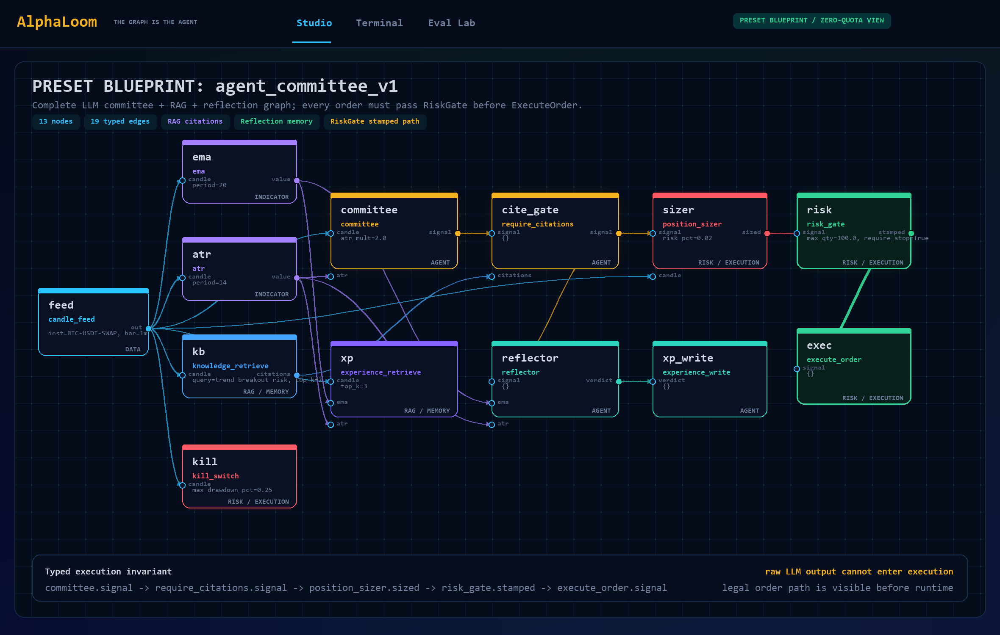

<strong>Realtime Offline Player.</strong> Generated from the same real OKX SOL replay: progress, equity, and fill events advance from recorded runtime data.

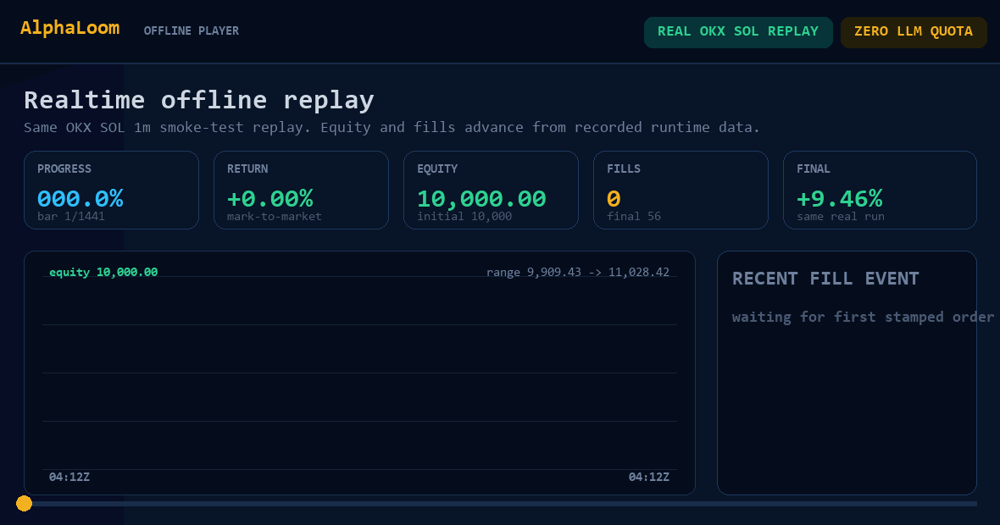

<table>
<tr>
<td width="50%">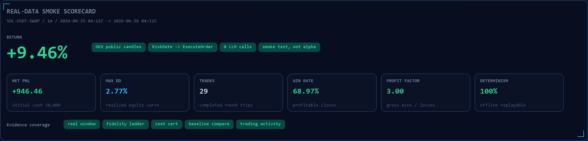</td>
<td width="50%">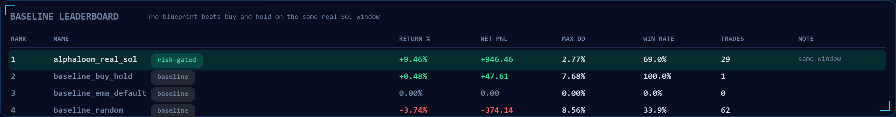</td>
</tr>
</table>

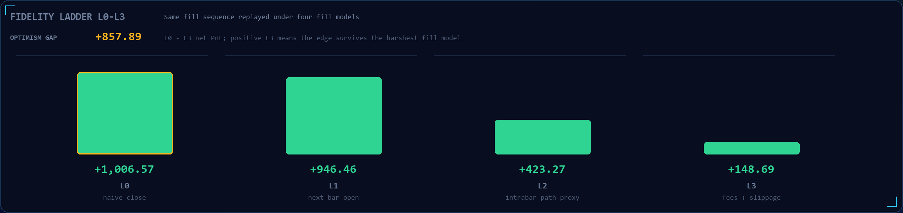

<table>
<tr>
<td width="50%">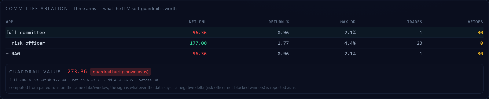</td>
<td width="50%">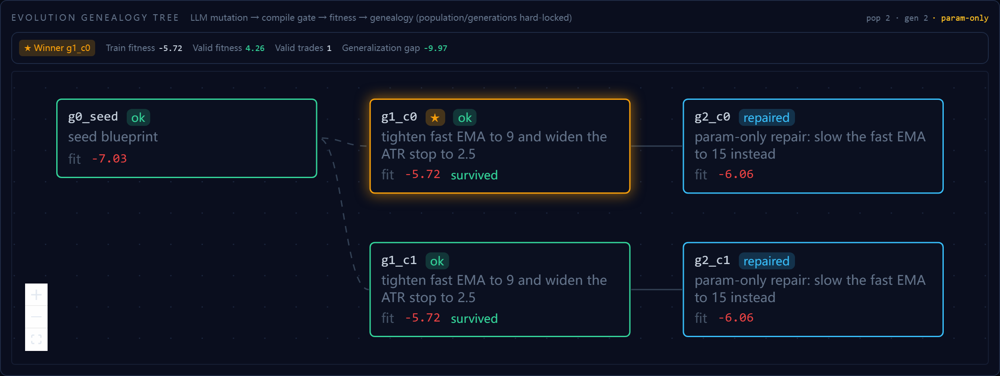</td>
</tr>
</table>

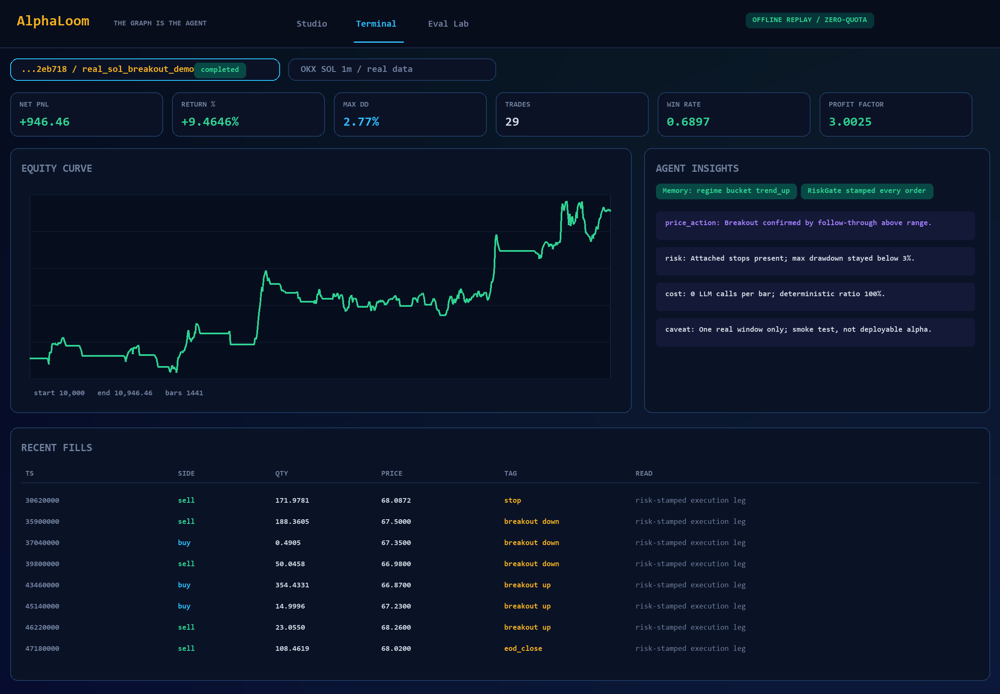

## 60 Second Demo Path

| Step | Show | Point |
|---|---|---|
| 1 | Studio graph | The agent is the blueprint, not hidden prompt glue. |
| 2 | Cost certificate + legal order path | The compiler knows token cost, deterministic ratio, and the only route to execution. |
| 3 | `risk_gate -> execute_order` | Raw LLM output cannot trade without a typed RiskGate stamp. |
| 4 | Live Desk | Candles advance, gates light up, sidecar analysis explains the current bar. |
| 5 | Terminal replay | Fills, equity, citations, node I/O, and reflection are inspectable. |
| 6 | Eval Lab | The same run faces baselines, ablations, and harsher fill models. |

<details>
<summary><strong>Manual startup</strong></summary>

```powershell
# backend
cd backend
py -3.12 -m venv .venv
.\.venv\Scripts\python.exe -m pip install -e .[dev]

# frontend
cd ..\frontend
npm install
npm run build

# offline server
cd ..
$env:ALPHALOOM_OFFLINE = "1"
backend\.venv\Scripts\python.exe -m uvicorn alphaloom.serve:app --port 8000 --app-dir backend
```

</details>

<details>
<summary><strong>System map</strong></summary>

| Layer | What it does |
|---|---|
| Blueprint compiler | `.loom` JSON to typed graph, topological plan, cost certificate, and legal order path. |
| Event runtime | Wave execution, deterministic replay, breakpoints, WebSocket progress, full node I/O recording. |
| Backtest engine | Next-bar-open fills, attached stops, EOD settlement, no look-ahead reads. |
| Agent nodes | `LLMAnalyst`, `Committee`, deterministic gates, BM25 RAG, citation checks, reflector, memory. |
| Copilot | Natural language to blueprint, compile-error self-repair, explain, optimize, apply-and-run. |
| Sandbox | AST-whitelisted custom nodes with no LLM handle and no ability to forge the risk stamp. |
| Eval Lab | Fidelity ladder, scorecard, leaderboard, risk sensitivity, committee ablation, evolution genealogy. |

</details>

<details>
<summary><strong>Offline LLM recordings</strong></summary>

`ALPHALOOM_OFFLINE=1` replays committed recordings from `data/llm_calls.sqlite`.

- 835 deterministic seed responses for a rich zero-quota demo.
- 123 real iFlytek Spark `astron-code-latest` calls from a recorded `agent_committee` run.
- Live mode uses `LLM_BASE_URL`, `LLM_API_KEY`, and `LLM_MODEL` from `.env`.

</details>

## Docs

- [`docs/architecture.md`](docs/architecture.md) - code-aligned implementation architecture.
- [`docs/demo-script.md`](docs/demo-script.md) - 10-minute talk track.
- [`docs/evaluation-methodology.md`](docs/evaluation-methodology.md) - scoring caveats and trust boundaries.
- [`docs/real-data-smoke-test.md`](docs/real-data-smoke-test.md) - exact data window and reproduction notes.
- [`docs/future-work.md`](docs/future-work.md) - roadmap and known limits.

<div align="center">

**MIT (c) 2026 Zhao Chenghao**

</div>
