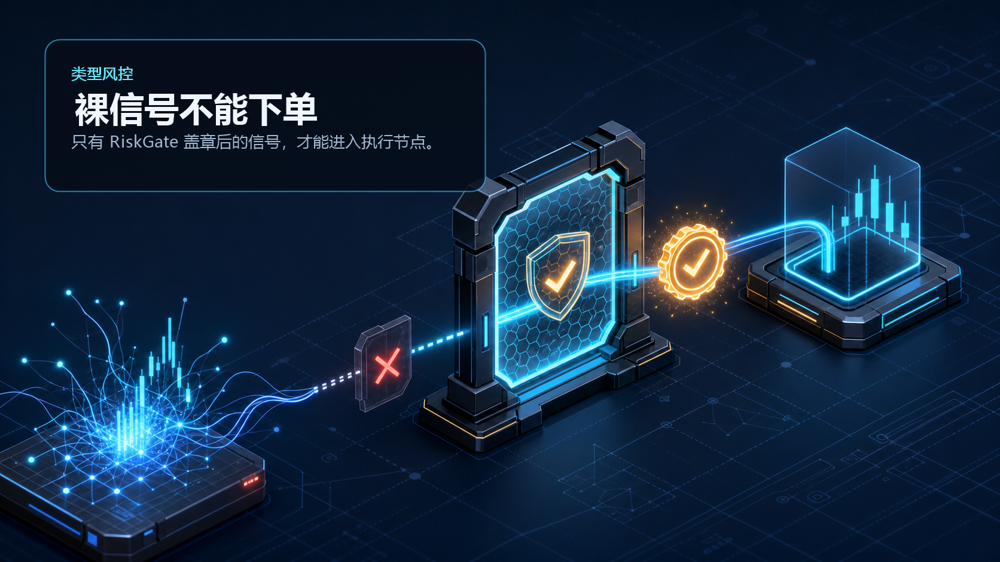
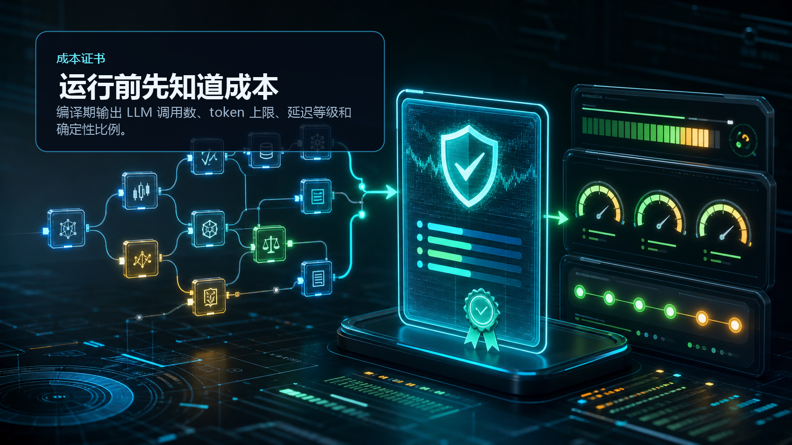
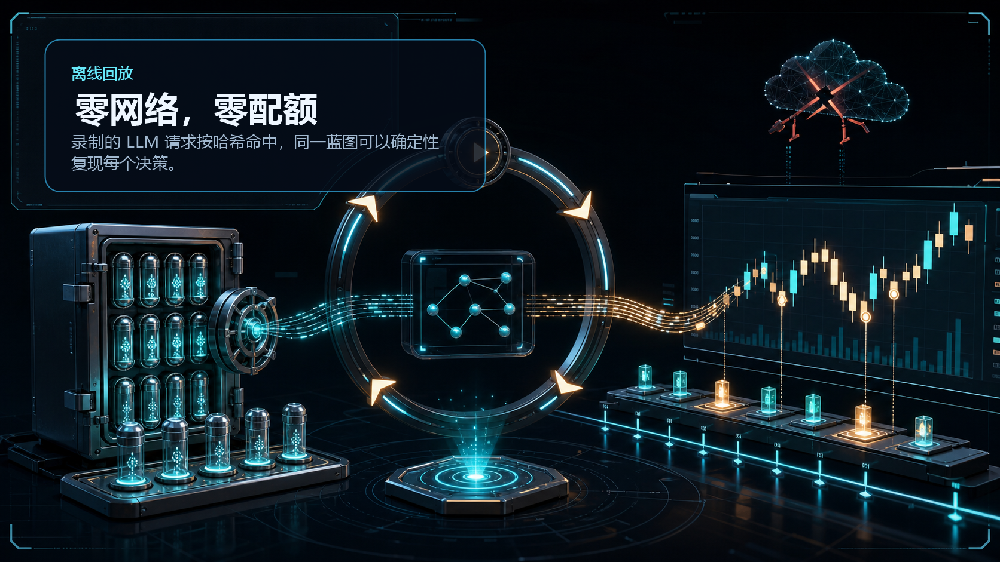
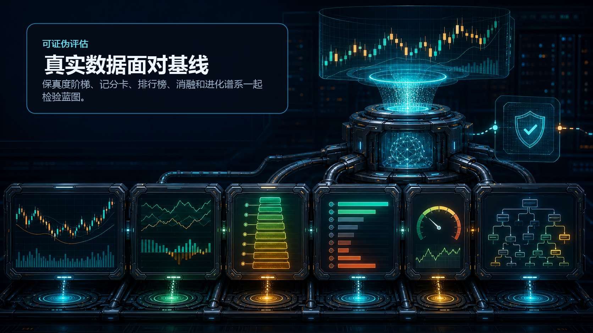
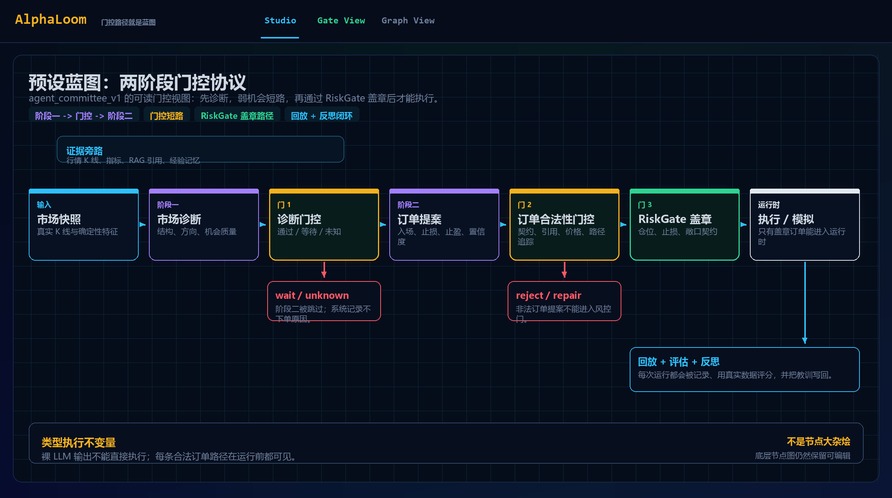

<div align="center">


<p>
  语言：
  <a href="README.md">English</a>
  ·
  <strong>中文</strong>
</p>

# AlphaLoom

**画出一个交易 Agent。编译它的风险合约。回放每一次决策。**

AlphaLoom 是一个 Agent-native 交易工作台：`.loom` 可视化蓝图会被编译成带类型约束、成本证书、实时增量运行、可回放、可证伪评估的交易 Agent。

[](https://github.com/ZhaoSH980/alphaloom/actions/workflows/ci.yml)
&nbsp;
&nbsp;
&nbsp;
&nbsp;

<br>


<table>
<tr>
<td align="center"><strong>蓝图原生</strong><br><sub>策略拓扑是可编辑的图，不是藏在 prompt 里的胶水逻辑。</sub></td>
<td align="center"><strong>编译门控</strong><br><sub>订单必须拿到类型化 RiskGate 盖章才能执行。</sub></td>
<td align="center"><strong>实时增量</strong><br><sub>每根新 K 线推进同一个运行上下文。</sub></td>
<td align="center"><strong>可证伪评估</strong><br><sub>同一条 run 会面对回放、基线、消融和更严格成交模型。</sub></td>
</tr>
</table>

**这张图不是 Agent 的说明图；这张图就是 Agent。**

</div>

## 这是什么

AlphaLoom 是为 AI Agent Engineer 展示设计的完整交易系统 demo：它把一个 LLM 交易想法变成可检查、可运行、可审计的图协议。第一层不是模型 prompt，而是一张可以编辑的蓝图：你可以随时添加、删除或重连确定性门控、LLM 委员会节点、RAG/引用检查、反思记忆、仓位 sizing 和执行风控。编译器会在运行前验证合法下单路径，所以系统能解释一笔订单为什么被放行、拒绝、回放或修复。

这不是投资建议，也不是 alpha 收益承诺；它展示的是一个可审计、可回放、可评估的 Agent 交易架构。

## 为什么 AlphaLoom 不一样

大多数 LLM trading demo 把最关键的部分藏在 prompt 记录里：模型读 K 线、输出 signal，然后观众只能相信这段叙事。AlphaLoom 把这些关键部分全部变成一等公民。

| 普通 LLM trading bot | AlphaLoom |
|---|---|
| prompt 文本就是策略 | `.loom` 图才是策略协议 |
| LLM 可以从观点直接跳到交易 | 裸 LLM 输出不能进入 `ExecuteOrder` |
| demo 成功靠截图说服 | run 可以用已记录 K 线和 LLM 调用重放 |
| 风控是 prompt 里的一段话 | 风控是编译器可见的类型化门控 |
| 评估靠解释是否好听 | Eval Lab 跑基线、保真度阶梯、消融和进化谱系 |

所以它更像一个 trading-agent operating system，而不是聊天机器人外壳：Copilot 可以提出蓝图，Live Desk 可以把新 K 线流进蓝图，Eval Lab 也可以反过来证伪它。

## 一键启动

双击：

```bat
START_ALPHALOOM.cmd
```

启动器会自动补齐缺失依赖、构建前端、准备确定性 demo 数据库、启动后端，并打开：

```text
http://127.0.0.1:8000/?alphaloom=...#/studio
```

默认是 **离线模式**：录制好的 LLM 调用、录制好的市场数据、零网络请求、零 LLM quota。

## 运行模式

顶栏可以随时切换三种模式：

| 模式 | 适合做什么 | 需要什么 |
|---|---|---|
| 离线 | 安全演示、确定性回放、已提交的讯飞/seed 录制 | 不需要配置 |
| 实时 | 在 UI 里调用真实 OpenAI-compatible LLM | `.env` 填好 `LLM_BASE_URL`、`LLM_API_KEY`、`LLM_MODEL` |
| 无 LLM | 纯确定性蓝图、编译检查、市场回测 | 不需要配置 |

实时模式配置：

```env
LLM_BASE_URL=https://your-openai-compatible-endpoint/v1
LLM_API_KEY=...
LLM_MODEL=astron-code-latest
```

重启 `START_ALPHALOOM.cmd` 后，在右上角把 `离线 -> 实时` 即可。实时模式会消耗真实 quota。

## 产品界面

| 界面 | 展示什么 | 为什么重要 |
|---|---|---|
| 蓝图工坊 | 可编辑 `.loom` 蓝图、类型边、成本证书、Copilot diff | Agent 就是图；你可以替换门控或添加新的 LLM 组件。 |
| Live Desk | PA_Agent 风格实时台：左侧蓝图，中间 K 线，右侧门控/反思/LLM 分析 | `LiveSession` 把 K 线流入同一个运行上下文，图会按 bar 推进。 |
| 交易终端 | Run 选择器、trace explorer、节点 I/O、委员会/反思证据 | 每个决策都能回放和审计。 |
| 评估实验室 | 保真度阶梯、记分卡、基线排行榜、消融、进化谱系 | 结果要面对市场证据，而不是只靠好听的解释。 |

## 蓝图为什么不一样

<br>
<strong>风控是类型约束。</strong><br>
<code>ExecuteOrder</code> 只接收 <code>risk_stamped_signal</code>。裸 LLM 信号不能直接下单。

<br>
<strong>运行前就知道成本。</strong><br>
编译器会输出每根 bar 的 LLM 调用数、token 上限、延迟等级、确定性比例和合法执行路径。

<br>
<strong>演示可以完全离线。</strong><br>
LLM 请求被 canonicalize 后哈希记录；离线模式复用同一批响应，零网络、零 quota。

<br>
<strong>评估是可证伪的。</strong><br>
真实 K 线、成交保真度阶梯、基线、风险敏感性、消融和进化谱系一起判断蓝图。

## 回测和回放怎么做

在蓝图工坊或 Live Desk 里启动回测时，需要选择：

| 控件 | 含义 |
|---|---|
| Blueprint | 要运行的 `.loom` 编译图 |
| Market / bar | 本地行情目录里的交易对和 K 线周期 |
| Start / end | 精确回放窗口；图表只展示这个时间范围 |
| Cash / fee | 初始资金和手续费假设 |
| Speed | `1x`、`4x` 或 instant 回放 |

运行时，图表游标会按顺序揭示 K 线、成交、权益曲线和活跃节点。回测引擎使用 next-bar-open 成交、附加止损、EOD 结算，并禁止 look-ahead；评估实验室还能把同一批成交放到更严格的保真度模型下重放。

## 实时增量循环

Live Desk 的设计目标是接近 PA_Agent 风格的交易控制台，但中间多了一层 AlphaLoom 的编译门控：

1. 后端 `LiveSession` 按 `instrument + bar + timestamp` 拉取或回放 K 线。
2. 每根新 bar 会喂给同一个 `Engine` / `RunContext`；节点状态、持仓、反思记忆和风控状态都会延续。
3. sidecar LLM 读取最近 K 线、当前节点输出、风控状态、成交、回撤和记忆，然后输出右侧可审计分析卡片。
4. 每次 sidecar 输出都会记录 prompt hash、bar 时间戳、输入摘要、输出 JSON 和模型名，后续 Eval Lab 可以重放。

这样实时分析可以解释当前市场和蓝图状态，但不能绕过蓝图直接下单。

**执行边界：** Live Desk 是 paper-live，不是交易所账户执行。它可以轮询 OKX 公开 K 线并按实时节奏推进同一张图，但所有成交都走本地 `PaperBroker`；当前版本不会向 OKX demo 账户或真钱账户提交订单。

## Copilot 的作用

Copilot 是策略创作层。它可以根据自然语言新建 `.loom` 蓝图、解释现有图、调整门控参数、添加 LLM/RAG/反思节点、优化变体，也可以根据编译错误自动修复。

但它不是执行捷径。所有建议都会先以 diff 展示，然后必须通过类型图编译，才允许进入回测或执行路径。所以 LLM 可以作为策略作者和修复助手，真正守住执行边界的是门控图和编译器。

## 真实市场 Smoke Test

同一张蓝图、同一条类型风控路径，跑 OKX 公开历史数据：

| 项目 | 数值 |
|---|---|
| 蓝图 | [`blueprints/real_sol_breakout_demo.loom`](blueprints/real_sol_breakout_demo.loom) |
| 行情 | OKX public `SOL-USDT-SWAP` 1m candles |
| 窗口 | 2026-06-25 04:12Z 到 2026-06-26 04:12Z |
| 结果 | **+9.4646% return**, **2.7693% max drawdown** |
| 交易 | 29 trades, 68.97% win rate, profit factor 3.0025 |
| Buy and hold | +0.4761% return, 7.6801% max drawdown |
| Fidelity L3 | 最严格成交模型后仍有 +148.6884 net PnL |

这不是 alpha claim，只是一个真实数据 smoke test：证明系统能在真实历史行情上跑完整的编译、执行、回放和评估链路。复现说明见 [`docs/real-data-smoke-test.md`](docs/real-data-smoke-test.md)。

## 反思消融实验

这组 paired smoke ablation 只切换反思闭环，门控执行路径保持一致。它不是泛化收益承诺，而是在问一个更工程的问题：反思闭环是否真的改变交易行为，而不是只多写一段漂亮解释？

| 版本 | 交易 | 回报 | 胜率 | 最大回撤 | 盈利因子 |
|---|---:|---:|---:|---:|---:|
| 闭环学习版，含反思 | 9 笔 | **+0.90%** | **66.7%** | **4.65%** | **1.36** |
| 去反思版，消融 | 5 笔 | **-5.64%** | **0.0%** | 6.78% | 0.0 |

在这组对照里，去掉反思后 5 笔全亏；保留反思后变成小幅正收益。这个结果很适合展示 AlphaLoom 的核心：反思不是 prompt 装饰，而是可以被消融、被回放、被评估的系统组件。

## 视觉证据

<strong>预设蓝图 Studio。</strong> 第一张图把提交到仓库里的 `agent_committee_v1` 表达为两阶段门控协议：先诊断，弱机会短路，订单校验后通过 RiskGate 盖章，再执行或回放。



<strong>实时离线 Player。</strong> 这张 GIF 由同一段真实 OKX SOL 回放数据生成，进度、权益曲线和成交事件都会随时间推进。


<table>
<tr>
<td width="50%"></td>
<td width="50%"></td>
</tr>
</table>


<table>
<tr>
<td width="50%"></td>
<td width="50%"></td>
</tr>
</table>


## 60 秒展示路线

| 步骤 | 展示什么 | 说明什么 |
|---|---|---|
| 1 | Studio 蓝图 | Agent 就是图，不是藏在 prompt 里的胶水代码。 |
| 2 | 成本证书 + 合法下单路径 | 编译器知道 token 成本、确定性比例和唯一执行路线。 |
| 3 | `risk_gate -> execute_order` | 裸 LLM 输出没有 RiskGate 类型盖章就不能交易。 |
| 4 | Live Desk | K 线推进、门控点亮、sidecar 分析解释当前 bar。 |
| 5 | Terminal 回放 | 成交、权益曲线、引用、节点 I/O 和反思都能追溯。 |
| 6 | Eval Lab | 同一条 run 要面对基线、消融和更严格成交模型。 |

<details>
<summary><strong>手动启动</strong></summary>

```powershell
# backend
cd backend
py -3.12 -m venv .venv
.\.venv\Scripts\python.exe -m pip install -e .[dev]

# frontend
cd ..\frontend
npm install
npm run build

# offline server
cd ..
$env:ALPHALOOM_OFFLINE = "1"
backend\.venv\Scripts\python.exe -m uvicorn alphaloom.serve:app --port 8000 --app-dir backend
```

</details>

<details>
<summary><strong>系统模块</strong></summary>

| 层 | 作用 |
|---|---|
| Blueprint compiler | `.loom` JSON 编译成 typed graph、topological plan、cost certificate 和合法下单路径。 |
| Event runtime | wave-based 执行、确定性回放、断点、WebSocket 进度、完整 node I/O 记录。 |
| Backtest engine | next-bar-open 成交、止损、EOD 结算、禁止 look-ahead。 |
| Agent nodes | `LLMAnalyst`、`Committee`、确定性 gate、BM25 RAG、citation check、reflector、memory。 |
| Copilot | 自然语言生成蓝图、编译错误自修复、解释、优化、应用并回测。 |
| Sandbox | AST 白名单自定义节点，拿不到 LLM handle，也不能伪造 risk stamp。 |
| Eval Lab | fidelity ladder、scorecard、leaderboard、risk sensitivity、committee ablation、evolution genealogy。 |

</details>

<details>
<summary><strong>离线 LLM 录制</strong></summary>

`ALPHALOOM_OFFLINE=1` 会回放 `data/llm_calls.sqlite` 里提交的记录：

- 835 条 deterministic seed response，用于丰富的零 quota demo。
- 123 条真实 iFlytek Spark `astron-code-latest` 调用记录。
- live 模式通过 `.env` 里的 `LLM_BASE_URL`、`LLM_API_KEY`、`LLM_MODEL` 启用。

</details>

## 文档

- [`docs/architecture.md`](docs/architecture.md) - 与当前代码对齐的实现架构文档。
- [`docs/demo-script.md`](docs/demo-script.md) - 10 分钟展示讲稿。
- [`docs/evaluation-methodology.md`](docs/evaluation-methodology.md) - 评分方法、可信边界和 caveat。
- [`docs/real-data-smoke-test.md`](docs/real-data-smoke-test.md) - 真实 OKX 数据窗口与复现说明。
- [`docs/future-work.md`](docs/future-work.md) - 已知边界和路线图。

<div align="center">

**MIT (c) 2026 Zhao Chenghao**

</div>
